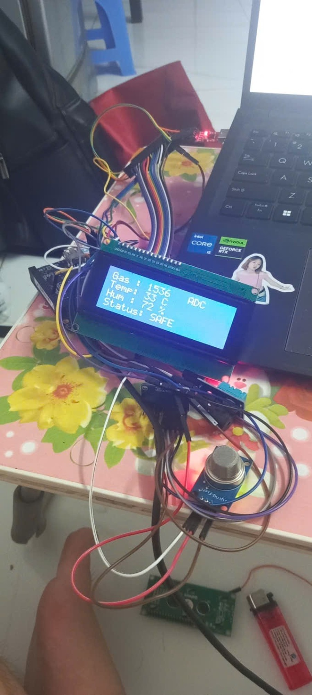
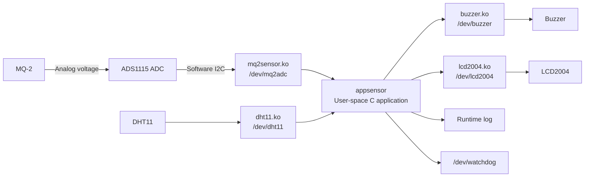
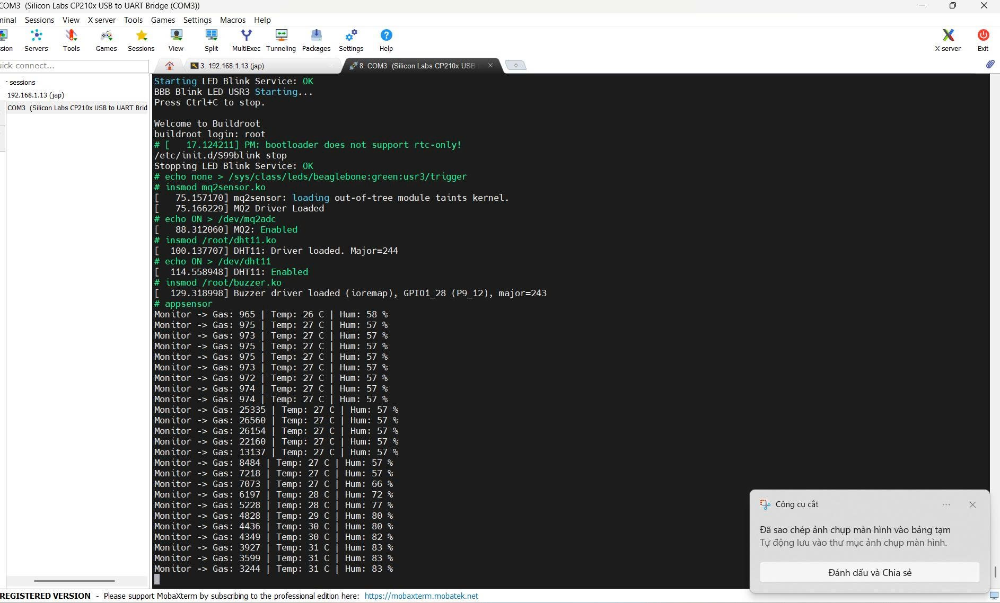
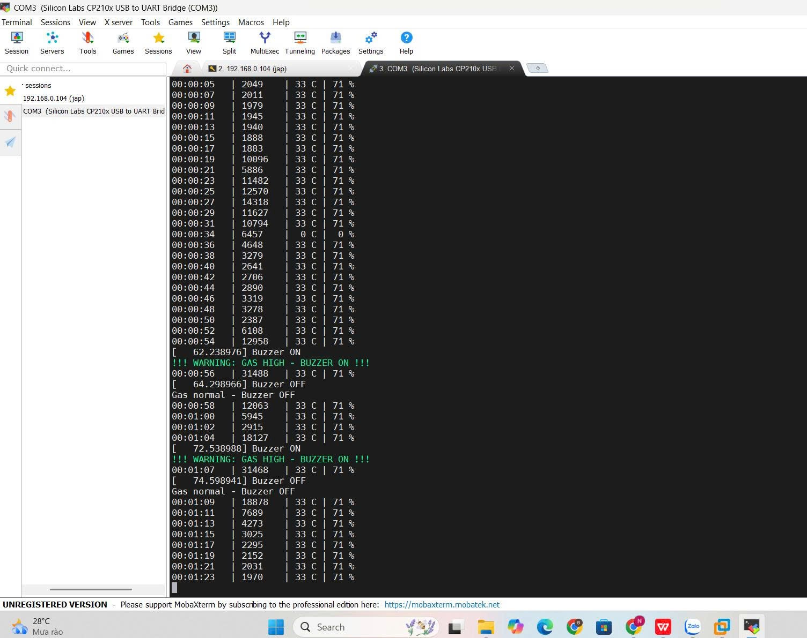

# Embedded Linux Gas Monitoring & Alert System

> **BeagleBone Black · Buildroot · Linux Kernel Modules · C · MQ-2 + ADS1115 · DHT11 · LCD2004 · Watchdog**

<p align="center">
  
</p>

## Overview

This project implements an **Embedded Linux gas monitoring and warning system** on the **BeagleBone Black**. The system reads an MQ-2 gas sensor through an **ADS1115 16-bit ADC**, monitors temperature and humidity with a **DHT11**, displays live status on an **LCD2004**, and activates a buzzer when the gas ADC value crosses a configured threshold.

The software is divided into **Linux kernel-space drivers** and a **user-space C application**. Hardware devices are exposed through character-device nodes under `/dev`, while **Buildroot** is used to integrate the drivers, application, and startup script into the target Linux image.

> **Note:** the gas value shown in this project is the **raw ADS1115 ADC value**, not a calibrated gas concentration in ppm.

## Key Features

- Linux character device drivers for sensor/actuator access
- MQ-2 analog acquisition through ADS1115
- GPIO-based **software I²C bit-banging** for the ADS1115 path
- Direct GPIO register access using `ioremap()`, `ioread32()`, and `iowrite32()`
- DHT11 temperature/humidity monitoring
- LCD2004 local display and buzzer warning
- User-space C application using `open()`, `read()`, `write()`, and `ioctl()`
- Watchdog keep-alive and runtime logging
- Buildroot custom-package integration and `init.d` autostart

## System Architecture



## Device Interfaces

| Device node | Access | Purpose |
|---|---|---|
| `/dev/mq2adc` | read / write | Read ADS1115 ADC value and enable/disable MQ-2 acquisition |
| `/dev/dht11` | read / write | Read temperature/humidity and enable/disable acquisition |
| `/dev/buzzer` | read / write | Control and query buzzer state |
| `/dev/lcd2004` | write | Display formatted system status |
| `/dev/watchdog` | ioctl | Feed the Linux watchdog |

## MQ-2 + ADS1115 Driver Path

The MQ-2 produces an analog signal. The ADS1115 converts that signal into a 16-bit digital value, which is read by the Linux driver through software I²C implemented on GPIO pins.

```text
MQ-2 analog output
        ↓
ADS1115 16-bit ADC
        ↓
GPIO software I²C
        ↓
mq2sensor.ko
        ↓
/dev/mq2adc
        ↓
User-space application
```

The driver exposes values to user space in a simple format such as:

```text
ADC: 31488
```

## My Contributions

My main work in this project focused on the **MQ-2 Linux device driver and Embedded Linux integration**:

- Developed a **Linux Character Device Driver** for MQ-2 data acquisition through the ADS1115 ADC.
- Implemented GPIO-based **I²C bit-banging**, including START/STOP conditions, byte transfer, ACK handling, ADS1115 configuration, and 16-bit conversion reads.
- Exposed sensor acquisition to user space through **`/dev/mq2adc`**.
- Implemented driver **`read()` / `write()`** operations for ADC transfer and sensor control.
- Participated in the **LCD2004 driver** development.
- Integrated kernel modules and the monitoring application into a **Buildroot-based Embedded Linux image**.

The complete system also integrates DHT11 sensing, buzzer warning, LCD display, watchdog supervision, logging, and automatic startup.

## Demo Results

### Kernel modules and live sensor monitoring

<p align="center">
  
</p>

The terminal output demonstrates kernel-module loading, sensor enable commands, and live gas/temperature/humidity acquisition.

### Threshold-based gas warning

<p align="center">
  
</p>

In the current application, the warning threshold is configured as:

```c
#define GAS_THRESHOLD 30000
```

When the ADC value reaches or exceeds the threshold, the application activates the buzzer and reports `GAS HIGH - BUZZER ON`. When the value falls below the threshold, the buzzer is turned off.

## Buildroot Integration

The project is integrated into Buildroot as custom packages. Kernel modules are cross-compiled against the target Linux kernel, while the monitoring application is built with the target toolchain and installed into the root filesystem.

At boot, the `S99appsensor` init script performs the startup sequence:

```text
Boot Buildroot Linux
        ↓
Load kernel modules
        ↓
Enable sensor acquisition
        ↓
Start /usr/bin/appsensor
        ↓
Monitor sensors and control warning outputs
```

## Repository Structure

```text
Embedded-Linux-Gas-Monitoring/
├── README.md
├── package/
│   ├── appsensor/
│   ├── mq2sensor/
│   ├── dht11/
│   ├── buzzer/
│   └── lcd2004/
└── docs/
    └── images/
        ├── hardware_setup.jpg
        ├── driver_startup.png
        └── alert_response.png
```

## Limitations

- Gas level is currently reported as raw ADS1115 ADC counts, not as a calibrated gas concentration in ppm.
- The gas warning threshold is currently a fixed compile-time value.
- Software I²C and direct GPIO register access are platform-specific to the BeagleBone Black implementation.
- The prototype uses development wiring; a production design would require a dedicated PCB, enclosure, and more robust power/interface design.

## Future Improvements

- Calibrate MQ-2 using `Rs/R0` for a defined target gas.
- Make the warning threshold configurable at runtime.
- Migrate the ADS1115 path to the Linux I²C subsystem where appropriate.
- Add Device Tree based hardware description.
- Add MQTT or a web dashboard for remote monitoring.
- Improve fault handling for disconnected sensors and invalid readings.

## Skills Demonstrated

`Embedded Linux` · `Buildroot` · `Linux Kernel Modules` · `Character Devices` · `C` · `GPIO` · `I²C` · `ADC` · `MMIO` · `Watchdog` · `BeagleBone Black` · `System Integration`
