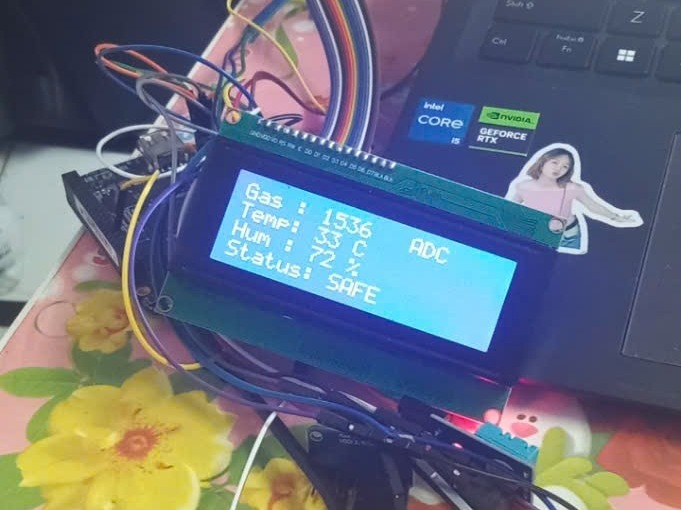

# Embedded Linux Gas Monitoring & Alert System

> BeagleBone Black · Buildroot · Linux Kernel Modules · C · MQ-2 + ADS1115 · DHT11 · LCD2004 · Watchdog

<p align="center">
  
</p>

## Overview

This project implements an **embedded Linux gas-monitoring and warning system** on the BeagleBone Black. The system acquires a raw analog signal from an MQ-2 gas sensor through an ADS1115 16-bit ADC, reads temperature and humidity from a DHT11 sensor, displays live values on an LCD2004, and activates a buzzer when the gas ADC value crosses a configured threshold.

The software is split between **Linux kernel-space device drivers** and a **user-space C monitoring application**. Device access is exposed through character-device nodes under `/dev`, while Buildroot is used to package the application and kernel modules into the target Linux image.

> **Measurement note:** the current implementation uses the **raw ADS1115 ADC value** as the gas indicator. It does not claim calibrated gas concentration in ppm.

## What the system demonstrates

- Embedded Linux development on **BeagleBone Black / ARM Cortex-A8**
- Linux **character device** interfaces between kernel space and user space
- Low-level GPIO access with `ioremap()`, `ioread32()`, and `iowrite32()`
- Software I²C bit-banging for **MQ-2 → ADS1115** acquisition
- DHT11 timing-based single-wire data acquisition with checksum validation
- Buzzer control through a GPIO-backed kernel module
- LCD2004 output over I²C using a PCF8574 interface
- User-space C integration using `open()`, `read()`, `write()`, and `ioctl()`
- Watchdog keep-alive and runtime logging
- Buildroot custom packages and `init.d` autostart

## System Architecture

```mermaid
flowchart LR
    MQ2[MQ-2 gas sensor] -->|Analog voltage| ADS[ADS1115 16-bit ADC]
    ADS -->|Software I2C| MQDRV[mq2sensor.ko\n/dev/mq2adc]

    DHT[DHT11] --> DHTDRV[dht11.ko\n/dev/dht11]

    MQDRV --> APP[appsensor\nUser-space C application]
    DHTDRV --> APP

    APP -->|ON / OFF| BUZDRV[buzzer.ko\n/dev/buzzer]
    BUZDRV --> BUZ[Buzzer]

    APP -->|Formatted status| LCDDRV[lcd2004.ko\n/dev/lcd2004]
    LCDDRV --> LCD[LCD2004]

    APP --> LOG[/var/log/sensor_monitor.log]
    APP --> WD[/dev/watchdog]

    BR[Buildroot Linux image] --- MQDRV
    BR --- DHTDRV
    BR --- BUZDRV
    BR --- LCDDRV
    BR --- APP
```

## Runtime Data Flow

```text
MQ-2
  │ analog voltage
  ▼
ADS1115
  │ 16-bit ADC data
  ▼
/dev/mq2adc ───────┐
                   │
DHT11              │
  ▼                │
/dev/dht11 ────────┤
                   ▼
              appsensor
                  │
       ┌──────────┼───────────┐
       │          │           │
       ▼          ▼           ▼
 /dev/buzzer  /dev/lcd2004   log file
       │          │
       ▼          ▼
    Buzzer      LCD2004
```

The application samples the sensors every **2 seconds**. In the current source, `GAS_THRESHOLD` is set to **30000 ADC counts**. When the MQ-2 ADC value reaches or exceeds this threshold, the application turns the buzzer on and updates the LCD with an alert state. When the ADC value returns below the threshold, the buzzer is turned off.

## Hardware

| Component | Purpose |
|---|---|
| BeagleBone Black | Main embedded Linux platform |
| MQ-2 | Gas-sensitive analog sensor |
| ADS1115 | 16-bit external ADC for MQ-2 analog output |
| DHT11 | Temperature and humidity sensing |
| LCD2004 + PCF8574 | Local status display over I²C |
| Buzzer | Audible warning output |

### Hardware prototype

<p align="center">
  
</p>

The LCD displays the current gas ADC reading, temperature, humidity, and warning state.

## Kernel / User-space Interface

The system uses character-device nodes as a simple interface between kernel drivers and the monitoring application:

| Device node | Direction | Role |
|---|---|---|
| `/dev/mq2adc` | read / write | Read ADS1115 ADC value; enable/disable acquisition |
| `/dev/dht11` | read / write | Read temperature/humidity; enable/disable acquisition |
| `/dev/buzzer` | read / write | Control and query buzzer state |
| `/dev/lcd2004` | write | Display formatted monitoring status |
| `/dev/watchdog` | ioctl | Keep the system watchdog alive |

### MQ-2 + ADS1115 path

The MQ-2 driver configures the ADS1115 at I²C address `0x48` and implements software I²C through GPIO. SDA and SCL are toggled directly through GPIO registers, and the resulting 16-bit conversion value is returned to user space as text such as:

```text
ADC: 31488
```

### User-space integration

The `appsensor` application opens the device nodes, parses the returned values, applies the warning threshold, controls the buzzer, updates the LCD, writes timestamped logs, and feeds `/dev/watchdog` during the main loop.

## Demo Evidence

### 1. Kernel modules and sensor acquisition

<p align="center">
  
</p>

The terminal shows the MQ-2, DHT11 and buzzer modules being loaded, the sensor interfaces being enabled, and the monitoring application receiving live readings.

### 2. Threshold-based gas warning

<p align="center">
  
</p>

The measured ADC value rises above the configured threshold (`30000`), producing `GAS HIGH - BUZZER ON`. When the value later drops below the threshold, the application issues `Buzzer OFF` and returns to the normal state.

## Buildroot Integration

The project is packaged as custom Buildroot components. Kernel modules are cross-compiled against the target Linux kernel, while the user-space application is compiled with the Buildroot target compiler and installed into `/usr/bin`.

The `S99appsensor` init script performs the runtime startup sequence:

```text
Boot Buildroot Linux
      ↓
Load mq2sensor.ko
Load dht11.ko
Load buzzer.ko
Load lcd2004.ko
      ↓
Enable MQ-2 and DHT11 device nodes
      ↓
Start /usr/bin/appsensor
```

This lets the monitoring system start automatically after the BeagleBone Black boots.

## Project Structure

A clean portfolio repository can be organized as:

```text
BTL/
├── README.md
├── package/
│   ├── appsensor/
│   │   ├── app.c
│   │   ├── Config.in
│   │   ├── appsensor.mk
│   │   └── S99appsensor
│   ├── mq2sensor/
│   │   ├── mq2sensor.c
│   │   ├── Makefile
│   │   ├── Config.in
│   │   └── mq2sensor.mk
│   ├── dht11/
│   ├── buzzer/
│   └── lcd2004/
├── docs/
│   ├── project_report.pdf
│   └── images/
│       ├── hardware_hero.jpg
│       ├── hardware_setup.jpg
│       ├── driver_startup.png
│       ├── alert_response.png
│       └── runtime_monitor.png
└── LICENSE
```

Adjust the source filenames to match the actual repository.

## My Contribution

My work in this project focused on the **MQ-2 Linux character device driver and Embedded Linux integration**:

- Developed a **Linux Character Device Driver** for the MQ-2 sensor, acquiring its analog signal through the **ADS1115 ADC** on BeagleBone Black.
- Implemented **I2C communication by GPIO bit-banging**, including START/STOP, byte transfer, ACK handling, ADS1115 configuration, and 16-bit conversion reads.
- Exposed the sensor to user space through **`/dev/mq2adc`**.
- Implemented kernel **`read()` / `write()`** operations to transfer ADC data between kernel space and user space and to control the sensor state.
- Participated in the development of the **LCD2004 driver**.
- Integrated the kernel modules and monitoring application into a **custom Embedded Linux image using Buildroot**.

The complete prototype also includes the DHT11, buzzer, LCD, watchdog, logging, and autostart components shown in the system architecture.

## Key Engineering Decisions

**Character devices for integration.** Sensor and actuator modules expose simple `/dev/...` interfaces, keeping the monitoring application independent from low-level register manipulation.

**Software I²C for the ADS1115 path.** The MQ-2 driver demonstrates low-level GPIO timing and I²C signaling instead of relying only on a high-level userspace library.

**Buildroot packaging.** Drivers and the monitoring application are integrated into a reproducible embedded Linux image rather than copied manually after every boot.

**Watchdog supervision.** The user-space application periodically issues `WDIOC_KEEPALIVE` so a system watchdog can detect application stalls.

## Limitations

- The MQ-2 value is currently a **raw ADC measurement**, not calibrated ppm.
- The alert threshold is a fixed compile-time value (`30000`).
- Software I²C uses direct GPIO register access and is hardware/platform specific.
- DHT11 timing is handled inside a kernel module and depends on tight timing.
- The prototype wiring is suitable for development/testing; a final product would use a dedicated PCB/enclosure and a more robust power/interface design.

## Possible Improvements

- Calibrate MQ-2 using `Rs/R0` and a defined target gas before reporting ppm.
- Move the gas threshold to a runtime-configurable interface.
- Replace raw GPIO bit-banging with the Linux I²C subsystem where appropriate.
- Add Device Tree based hardware description.
- Add MQTT or a web dashboard for remote monitoring.
- Store structured historical measurements for analysis.
- Add fault handling for sensor disconnects and repeated invalid reads.

## Skills Demonstrated

`Embedded Linux` · `Buildroot` · `Linux Kernel Modules` · `Character Devices` · `C` · `GPIO` · `I²C` · `ADC` · `MMIO` · `Watchdog` · `BeagleBone Black` · `System Integration`

## Documentation

The full course report is available in [`docs/project_report.pdf`](docs/project_report.pdf).

---

**Source repository:** `https://github.com/japdt099/Embedded-Linux-Gas-Monitoring`
